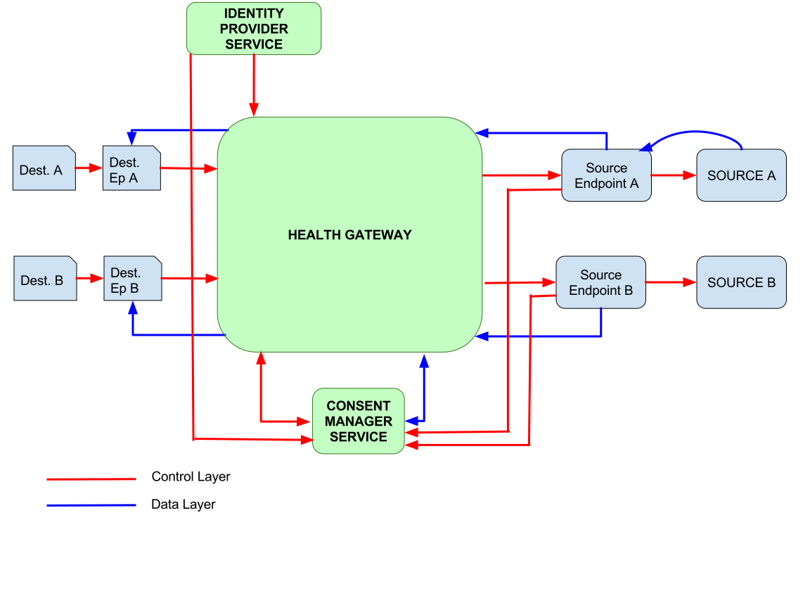
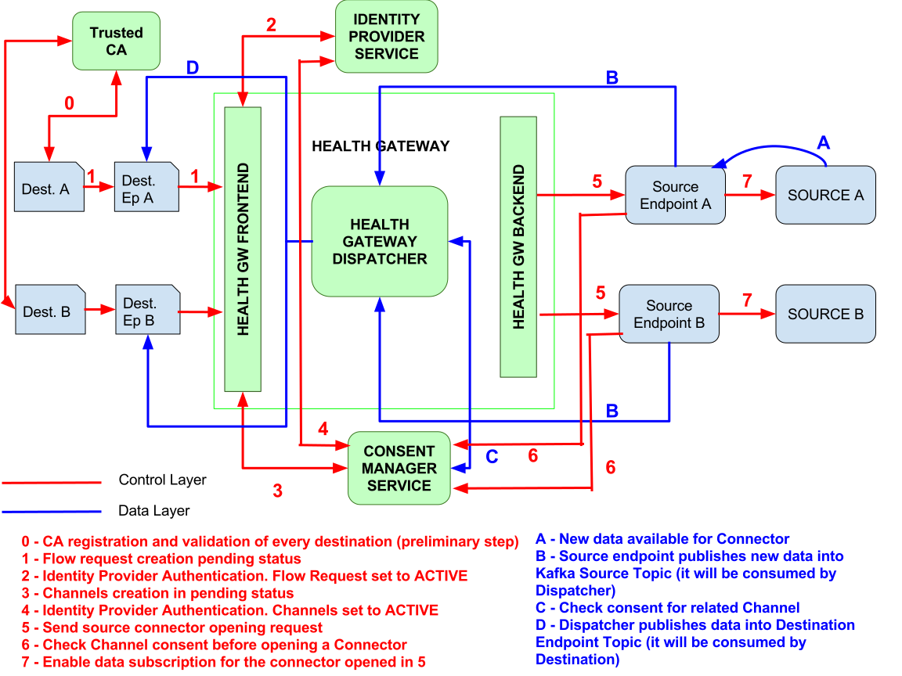

Architecture General Overview
=============================

The Health Gateway is a system that has two main objectives:

* to allow the establishment of a virtual communication (Channel)
  between two systems, the Source and the Destination,
  to send medical data related to a person, who has to mediate and
  authorize it.
* to mediate data delivering from the Source to the Destination according
  to the Channels


Main Components
***************

    The platform main components are:

    * **Destination**
        a Destination is a system where a person would like to forward a set
        of their data from a Source.

            * **Destination Endpoint (DE)**: it is a module of the Destination
              enabling it to receive the data from the authorized Sources.
              It is composed of the following subcomponents:

                * **Destination HGW API**: the module which interacts with
                  the API exposed by the Health Gateway to create, delete
                  and manage data flows authorized by the person;
                * **Destination Connection Module**: the data driver which
                  receives the authorized data from the Sources.
    * **Source**
        a Source is a system which holds person’s data and is authorized by
        the person to release a set of them to Destinations.

            * **Source Endpoint (SE)**: it is a module of the Source enabling
              it to send the data to the authorized
              Destinations. It is composed of the following subcomponents:

                * **Source HGW API**: the module which interacts with the
                  API exposed by the Health Gateway to create, delete and
                  manage data flows authorized by the person;
                * **Source Connection Module**: the data connection driver
                  which retrieve the authorized data from the Source.

    * **Health Gateway (HG)**
        The Health Gateway acts as an intermediary to allow a person to
        authorize the exchange of his/her data between the Destination
        and the Source. It also handles data routing from Sources to
        Destinations. It is composed of three sub-components:

        * Health Gateway Frontend (HGF)
            it manages the communications with the Destinations; it
            exposes an API which enables the person to open,
            authorize, modify or delete a data flow, redirecting the
            person to the Consent Manager, after their
            secure authentication on the Identity Provider;
            it notifies the Health Gateway Backend with the results
            of the identification/authorization steps to allow the
            system to perform and complete the operation
            requested by the person (as data flows opening, modification,...);
        * Health Gateway Backend (HGB)
            it manages the communications with the Sources; it receives
            the authorized requests for operations to be performed on data
            flows (as data flows opening, modification,...) from the Health
            Gateway Frontend and forwards them to the Source Endpoint;
        * Health Gateway Dispatcher (HGD)
            it handles data dispatching from Sources to Destinations.

    * **Consent Manager (CM)**
        it is the system that handles the authorization
        process. It informs the person about the data that will be
        exchanged between a Destination and the Sources and allows
        her/him to accept or not the data transfer. It also handles
        authorization for modification or revocation.

    * **Identity Provider (IDP)**:
        the Identity Provider identifies the person and provides their
        data to permit the Source to match its persons data to the person
        the data flow is related to.

Main Concepts
*************

    * **Profile**
        it is a tree data structure (as, for example, an openEHR archetype)
        defining what data the person authorizes to be sent to a Destination;
    * **Channel**
        a Channel is a logical connection between a Source and a Destination
        to tranfer data of a certain type belonging to a person. It is defined
        by the quadruple: (Source Endpoint, Destination Endpoint, Profile,
        Person ID). When a Channel is active the person’s data specified
        by the Profile are sent from the Source Endpoint to the Destination
        Endpoint.
        All channels have a validity time duration range associated to them.
    * **Flow Request**
        It is a request from a Destination to the HGW to start the process
        of opening one or more Channel for a Person
    * **Consent**
        authorization related to a Channel and given by a person, to transfer
        their data, as selected by the
        channel Profile, from a Source to a Destination.
    * **Connector**
        a Connector is an object, associated to a Channel,
        created through a request sent by the HGB to the
        Source Endpoint. A Connector enables the delivering of a person’s data,
        according to the Profile and Destination of the associated Channel.
        Its life-cycle corresponds to the one of the Channel associated: when
        it expires the Source Endpoint stops sending the related data.

High-level Process for a Data Flow Opening
******************************************

Preconditions
-------------

* The Destinations are registered as possible data targets in the CM
* The Sources are registered as possible data origin in the CM
* The HG and the CM are connected to the same IDP which is recognized
  by the Sources as a trusted person demographics owner
* The Destinations, the Sources and the CM share a set of valid
  Profiles among which the person can choose to decide which data she/he wants
  to share

Description
-----------
A person who wants to allow a data flow to a Destination enters in the
Destination user interface, selects the data Profiles and starts the
process to authorize the Destination to receive their clinical data.
The Destination inserts a Flow Request (about the Profile requested)
in the HGF, which redirects the user to the Identity
Provider, to perform the authentication. After that, the HGW instantiates
the Channels (one per known Source Endpoint), creates the corresponding
Consents into to the CM and redirects the user to the
CM
The CM shows the Consents corresponding to the Profile
initially chosen and the user selects the set of authorizations they
want to confirm and the list of data Sources. The CM
activates the Consents and informs the HGF which
activates the Channels and redirects the person’s User Agent to the
Destination. Meanwhile, the HGF sends a request to the
HGB to open Connectors in the Source Endpoints. Before
opening a Connector, the Source Endpoint must query the CM in
order to ensure that there is an active consent for the Connector’s associated
Channel. If the CM confirms there is an active Consent
associated to the Channel, the data flow can begin, according to the
Consent parameters (data profile, duration, ...).


Architecture
************

The pictures below shows the overall architecture of the system.
The HGW module is connected to all available Sources, on one side,
and to the available Destinations, on the other side.
Every endpoint is part of the correspondent Source and it acts as a
black-box between the backend of the HGW and the Source itself.



As shown in the detailed architecture diagram below, there are two
different layers of information, and consequently two different sub-layers
of architecture we can identify:

    * **Control Layer**: it concerns all the operations to fulfill to create
      and activate the Channels between a Destination and one or more available
      Sources for a person.
    * **Data Flows Layer**: it is related to the exchange of clinical data
      between the Sources and the HGW and the HGW and the Destinations.

The figure below depicts a schema of all the main components
(including both Sources and Destinations sides) and all the involved flows
for the control layer (in red) and the data layer (in blue). All main steps for
both flows are enumerated, and the legend describes the performed operations.
Notice that before data are sent
from the dispatcher to the destination endpoint, a control step (C)
is required, in order to ensure that the channel related to the current
message flow still has a valid consent.



Pilot Implementation Details
****************************

Control Layer
-------------

The **Control Layer** concerns all the operations to fulfill to create and
activate the Channels between a Destination and one or more available
Sources for a person. It is based on communications between the
components of the system which is illustrated in the figure below:

.. image:: _static/component_communications.svg

As we can see we have two type of communications:

*
    **REST communication**: it means that the services exposes REST endpoints
    to perform some actions. This kind of communication is used for:

        *
            Flow Request creation from the DE to the HGF
        *
            Consents creation from HGF to CM
        *
            Connector creation from the HGB to a SE

*
    **Messaging**: when an operation is asynchronous the Control Layer uses
    messaging with a message broker. Kafka is the broker of choice, but others
    can be used.
    This type of communications is used for:

        *
            Consents notification: used by the CM to notify to the HGF
            changes about the Consents status
        *
            Channels notification: used by the HGF to notify to the HGB
            changes about Channels
        *
            Connector notification: used by the HGB to notify to the HGF
            changes about Connector
        *
            Source notification: used by the HGB to synchronize Sources
            database in HGF. Infact, the master of the Sources' database is
            the HGB, but the HGF uses its own copy with fewer details about
            the Sources.


Destination and Source enrollment
#################################

The Health Gateway can interact only with known Destinations and Sources.
This means that they all have to be registered in the Health Gateway.
In order to be enrolled, a Destination must be granted and validated
by an Authority, which the Health Gateway trusts. This Authority releases
a pair of key/certificate to the Destination.
As a result of the enrollment process, Destinations and Sources obtain
different kind of data.
Destinations will have:

    * OAuth2 credentials:
        a client_id and a client_secret, that must be kept secret, needed
        to obtain OAuth2 tokens to interact with the REST API;
    * RSA private/public key pair:
        this are needed for the data payload encryption. The private key must
        be kept secret by the destination, while the public key is sent to
        the Sources to encrypt the messages payload
    * destination_id:
        it is an ID that identifies the Destination in the HGW. It is also
        the Kafka topic name assigned to the Destination;
    * Kafka client certs:
        key/certs to use to connect to Kafka. Kafka is indeed configured
        using HTTPS and to accept connections only by known clients.

.. note:: NB: The ```destination_id``` and the Kafka client certs are needed only when
   the destination wants to retrieve messages using a Kafka consumer

Sources will have:

    * source_id:
        it is an ID that identifies the Source in the HGW. Is is also the
        Kafka topic assigned to the Source where it sends the data
    * Kafka client certs:
        key/certs to use to connect to Kafka. As for the Destinations also
        the Sources needs a them to connect to Kafka

Channels Creation
#################

The process of Channel(s) creation is performed in two phases, the first
involving the User and the secondo asynchronously

The following sequence diagram describes the first phase

.. image:: _static/channel_instantiation_1.svg

The operations are the following:

    *
        The person enters the Destination web page with a User and starts
        the process to authorize the Destination to get their clinical data
    *
        The Destination creates a Flow Request in the HGF,
        specifying the Profile, a `callback_url`, which is a url where the
        User will be redirected at the end of the process, and
        the `flow_id` which is an identifier of the Flow Request
        created by the Destination. It is possible to specify a subset of the
        Sources to be considered for the request.
    *
        The HGF sets the Flow Request in PENDING status until
        the user authorizes it. It returns to the Destination a `process_id`
        and a `confirmation_id`: the `process_id` is the identifier of the
        Flow Request in the HGF and it will be used as the identifier of the
        messages sent to the Destination referring to the Channels created;
        the `confirmation_id` is a temporary ID that the Destination needs to
        include as parameter to the HGF confirmation URL to confirm
        the request.
    *
        The Destination redirects the User to the HGF
        confirmation url specifying the confirmation ID.
    *
        The HGF redirects the User to the IDP
        service to perform the authentication
    *
        The IDP authenticates the person and sends to the
        HGF their demographics
    *
        The HGF creates a Channel for every Source and for every
        Channel calls the CM to create a corresponding Consent.
        The Channel is set to ``CONSENT_REQUESTED (CR)`` status, while the
        Consent is set to ``PENDING`` status by the CM
    *
        The CM returns a temporary `confirmation_id` to be sent to
        its confirmation url,
        in a similar way as done for the Flow Request confirmation.
    *
        The HGF redirects the User to the Consent
        Manager confirmation url.
    *
        The CM redirects the User again to the IDP
        to identify the person. This time the person doesn’t need
        to perform the login since they are already logged in.
    *
        The CM shows the Consents that the user has to confirm
        and the user selects the set of authorizations they want to
        confirm and the list of Sources to authorize.
    *
        The CM sets the Consents to ACTIVE state and redirects
        the User to the HGF
        which redirects again to the Destination callback page

    From User's point of view the process is done, but at this moment,
    the Channel object is not ACTIVE (i.e., the clinical documents related
    to the Channel are not sent from the Source to the Destination).
    In fact only the corresponding Consent
    has been set to ACTIVE and the Source has not been notified about the
    Channel creation. To complete the Channel activation, the
    asynchronous communication among the CM, the HGF and the HGB starts.
    The following sequence diagram describes the second phase

    .. image:: _static/channel_instantiation_2.svg

    The operation are the following:

    *
        The CM sends a Consent Update message to the Health
        Gateway Frontend notifying that the Consent has been confirmed by
        the User
    *
        The HGF sets the Channel's status to
        ``WAITING_SOURCE_NOTIFICATION (WS)``, which means that it is waiting that
        the Source is notified about the Channel creation event
    *
        The HGF sends a message to the Health Gateway
        Backend with the data of the Channel
    *
        The HGB receives the message and calls the REST endpoint
        of the SE to create a Connector.
    *
        The SE, before accepting the Connector creation, queries the
        CM to check if there actually is an active Consent for the Connector
    *
        If the operation is accomplished, the HGB send a message to the
        HGF, notifying that the Source has been connected correctly
    *
        The HGF sets the Channel status to ACTIVE

Security
########

The Control Layer is secured by using HTTPS connection for all the
communications among the components. Also, the HGF and the
CM are secured using OAuth2 client-credentials
authentication (https://tools.ietf.org/html/rfc6749#section-4.4).
This means that a DE has to obtain an OAuth2 access token,
before continuing the process of Flow Request creation.
The Source Endpoint is also required to implement an authentication
mechanism for the HGB, for example using OAuth2 or
client certificates.

Data Flow Layer
---------------

The **Data Flows Layer** is related to the transfer of clinical data
between Sources and HGW and the HGW and the Destinations, and it is
based on Kafka.
The HGW acts as a Kafka Consumer for all data provided by the Sources
(producers), and acts as a Kafka Producer when providing data to the
Destinations.
A topic for each different Source (with a well defined ID) will be created.
Some key aspects about the design and implementation of this Kafka-based data
flow layer are the following.

    *
        The Destinations and the Sources have assigned one topic. A Source
        sends data to its topic while a Destination consumes data from
        its topic.
    *
        Destinations can decide to consume its data in two ways:
        by implementing a Kafka Consumer for its topic or by using
        a REST API exposed by the HGF. The two options
        are mutually exclusive.
    *
        The Destinations doesn’t know the Sources from which the data come
        from, unless the Source itself inserts the information in the
        data payload.
    *
        The Sources include the channel_id as the Kafka message key to allow
        the HGW dispatcher to route the message
        to the correct Destination.
    *
        The HGD uses the process_id as the Kafka message key to
        allow the Destination to know to which person assign the message.
    *
        The HGD is unaware of the data that transit between a
        Source and a Destination, since the payload of the message is
        encrypted by the Source and only the Destination can decrypt it.
        The only information that HGD knows is the Destination
        to which route the message.

The architecture is described in the following diagram

    .. image:: _static/kafka_based_hgw.svg

Overall data exchange process
#############################

    The following are the steps to transfer data from a Source to a Destination

    1.
        The Source encrypts the data using the Destination public key
        (see :ref:`data-encryption-label` for the details)
    2.
        The Source sends a message to its topic (i.e., the topic with name
        `source_id`) specifying the `channel_id` as the key
    3.
        The HGD consume the message from the Source topic and
        gets the `channel_id`.
    4.
        The HGD queries the CM for the status of
        the Channel
    5.
        If the Channel is active the HGD queries the HGW
        Frontend for the `process_id` related to the `channel_id`
    6.
        The HGD sends a message to the Destination's topic
        (i.e., the topic with name `destination_id`) specifying the
        `process_id` as the message key
    7.
        The HGD sends a message to the Destination’s topic
        (i.e., the topic with name destination_id)
        specifying the process_id as the message key.
        The Destination gets the message from its topic and decrypts it
        with its private key. It can consume messages directly from its topic
        implementing a Kafka Consumer or it can use the REST API of the
        HGF.

Security
########

An important requirement of the Health Gateway is that the data transfer
from a Source to a Destination must be secure and the data must be read
only from the correct Destination; even the HGW must not be able to
read the sensitive data of a message. To achieve this goal, the Health
Gateway supports two levels of encryption:

SSL encryption to connect and send data to the Kafka Broker;
Encryption of data payload

With the first level of encryption it is guaranteed that messages
sent from a Kafka Producer (Source) or to a Kafka Consumer
(Destination) are encrypted: consequently, if they are intercepted
by an attacker they cannot be decrypted. This level is implemented
by Kafka itself using HTTPS protocol, so it’s just a matter of configuration.
Moreover, to guarantee that only the correct clients can access to a
specific topic, Kafka Broker is configured to use HTTPS client authentication
and Access Control List to the topics. When a Destination is configured to
consume messages as Kafka Consumer, the Kafka ACL permits only the
Destination’s Consumer to access its topic. In the case
of Destination is configured to use a REST API, the ACL is configured
to give access to the topic just to the HGF. In this case it is
guaranteed that only the correct Destination can get the data by using
the OAuth2 protocol: the REST API requires an OAuth2 access token,
which is associated to the Destination and so to the topic,
and so the HGF knows the correct topic to use when it
receives REST requests.

The second level of encryption guarantees that the data that go through
the HGW can be decrypted only from the correct Destination. During the
instantiation of a Channel, the Source is provided with the
Destination’s public key. When the Source sends a message it uses the
key to encrypt a symmetric key used in turn to encrypt the payload.
In this way the Destination, and only it, can decrypt the symmetric key
and then the message. Data encryption are described in details in
:ref:`data-encryption-label`

.. _data-encryption-label:

Data Encryption
###############

As said before the Source encrypts the data payload using the Destination
public key. What actually happens is that the data are encrypted using an
AES key which is encrypted itself using the RSA public key of the
Destination. So when the Destination receives a message, it gets the
RSA encrypted AES key, decrypts it using its private key and then
decrypts the message using the AES key. It is to be said that the RSA
decryption phase is computationally heavy, so it is possible to use the
same AES key for more than one message and send a hash of the key
included in the message. When the Destination receives the message,
it checks if the hash is the same as the message before: if it’s not it
decrypts the AES key and stores the hash and the key, otherwise it uses
the same key as before, avoiding the RSA decryption of the key. The policy
to use to change the AES key is left to the Source.

The overall payload will be structured as follow:
    * 2 MAGIC BYTES (0xdf 0xbb) they indicates if the message is encrypted
      or not
    * 3 bytes indicating

        * the length of the AES key hash
        * RSA factor f so that f*128*8 evaluates to the RSA key size (in bits)
        * length of the AES initialization vector
    * AES hash
    * RSA encrypted AES key
    * Initialization vector
    * AES encrypted message

The methodology used is described in
https://blog.codecentric.de/en/2016/10/transparent-end-end-security-apache-kafka-part-1/

User authentication
-------------------

As explained before, the Health Gateway and the CM, delegate an
external service for user authentication. In fact they are implemented as
`SAML2 <https://en.wikipedia.org/wiki/SAML_2.0>`_ Service Providers, so
they can easily be configured to use all standard Identity Providers.
In the pilot study, two services has been considered:

    * SPID (Sistema Pubblico di Identità Digitale): it is an Italian
      service for digital identity used by the public administration
      digital services and it is candidated to be used also at European
      level. In the pilot implementation it has been used the
      development docker image provided by AgID (Agenzia per l'Italia
      Digitale)
    * TS/CNS (Tessera Sanitaria - Carta Nazionale dei Servizi): it is
      another Italian authentication method that requires a client
      certificate authentication. The certificate is provided by the
      Italian Government to its citizens and it is embedded in a smartcard.

SPID
####

SPID is the Italian service for digital identity to access the public
administration services and to private services that wants to adhere.
It is implemented as a SAML2 Identity Provider. For testing and
development purposes, in the context of the pilot, two docker images have been
created (crs4/spid-testenv-identityservice and crs4/spid-testenv-backlog).
The docker images extend the docker images provided by
`AgID <https://github.com/italia/spid-testenv-docker>`_.


TS/CNS
######

The TS/CNS is basically a standard
`client certificate <https://en.wikipedia.org/wiki/Client_certificate>`_
authentication method. This method requires the client (i.e., the browser)
to present a client certificate signed by a Certification Authority recognized
by the web server, to access the website. In the case of TS/CNS the certificate
is embedded in a personal smart card given by the government to the citizens
and it is signed by one of regional Certification Authorities. In order to use
the certificate, the citizen needs a smart card reader to be configured in
his/her PC or browser.

In the pilot implementation, it has been created a
`Shibboleth <https://www.shibboleth.net>`_ docker image (crs4/tscns),
configured to use client certificate authentication with the regional
Certification Authorities which sign the citizens certificates.
For development purpose, the image can use also a development
certification authorities and client certificates
that can be created with the certs scripts.
